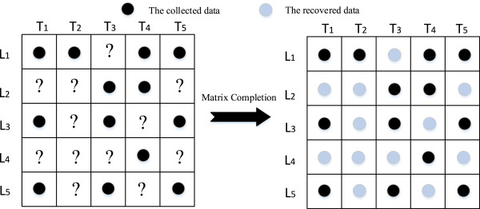
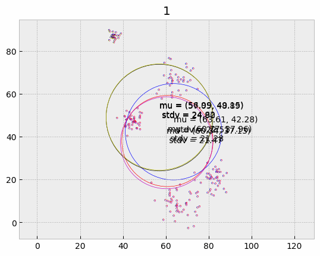

## Matrix Completion using Gaussian Mixtures

- Read the full report [here](report.pdf): 

#### Problem Description

A data set can be represented as a matrix, with rows indicating different data instances, and the
columns representing different attributes of a particular instance. However, most of the real-world
data sets are incomplete, i.e due to various reasons, they have missing entries. The presence of
missing values and incompleteness in data causes many issues in real-world data analysis. In this project we will implement a technique that makes use of a Gaussian mixture model to fill in incomplete entries of a matrix. This method assumes that the data instances (rows of the matrix) are independently sampled from a mixture of Gaussian distributions, and thereby proceeds to estimate the parameters of those unknown Gaussians (using iterative expectation-maximization algorithm which converges to a fixed solution after many iterations). Once the underlying distribution is estimated, the missing values of the data matrix can be filled by using the average mixture statistics, thereby approximately "recovering" the missing data. For demonstration purposes, we will use the Movie Ratings data set by Netflix. The rows of this data set are different Netflix users,
and the columns are rating given to different movies. Initially, this matrix has many missing
entries since not all users would have watched all the movies. We will also use 2 experimental
(synthetic) data matrix.

#### GIF showing the converging Gaussian mixture 

